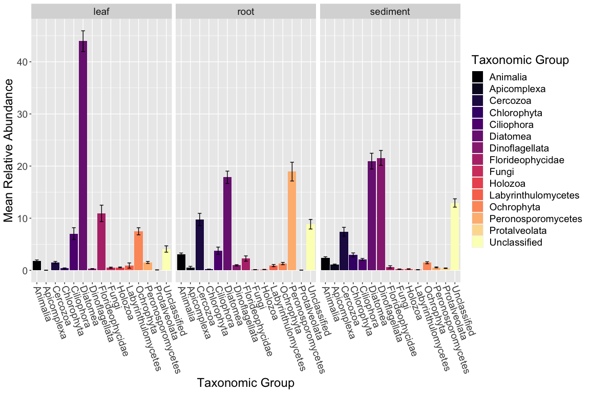
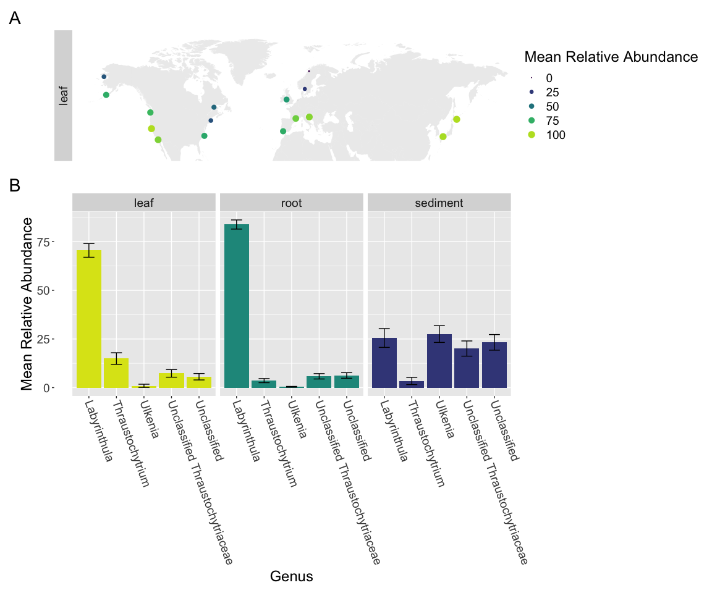

R code used to analyze Labyrinthula in JGI 18S amplicons from a global
survey of Zostera marina
================
Cassie Ettinger
2022-07-19

This RMarkdown follows the analysis of 18S amplicon data to look at the
eukaryotic component of the <i>Zostera marina</i> (ZM) microbiome. This
dataset and part of this analysis were previously published as part of a
paper on the ZM mycobiome, whilst other parts of this analysis are taken
my PhD dissertation. Dome of the previous code/analysis is copied and
modified here to ensure this unit is reproducible on its own and
consistent with the previous work.

If you use this data or analysis please cite the following accordingly:

Ettinger C.L. 2020. casett/Global_ZM_fungi_amplicons v1.0. DOI:
<https://doi.org/10.5281/zenodo.4116550>.

Ettinger C.L., Vann L.E. and Eisen J.A., 2020. Global diversity and
biogeography of the Zostera marina mycobiome. AEM. DOI:
<https://doi.org/10.1128/AEM.02795-20>

Ettinger, C. 2020. Taxonomic Diversity of the Bacterial and Fungal
Communities Associated with the Seagrass, Zostera marina.
<https://www.proquest.com/docview/2460090049>

### Loading packages and setting up the analysis

First, load in the R packages that will be used and make note of their
versions.

``` r
library(ggplot2)
library(vegan)
library(phyloseq)
library(RColorBrewer)
library(coin)
library(knitr)
library(rmarkdown)
library(FSA)
library(reshape)
library(betapart)
library(dada2)
library(tidyverse)
library(magrittr)
library(ShortRead)
library(ade4)
library(geosphere)
library(ecodist)
library(DESeq2)
library(VennDiagram)
library(limma)
library(maps)
library(viridis)
library(microbiome)
library(patchwork)
library(EcolUtils)
library(biobroom)
library(scales)
library(ggplotify)
library(Hmisc)
library(minpack.lm)
# show_col(viridis_pal(option = 'C')(20)) #get hex codes

# Get R package references sink('test.bib') out <-
# sapply(names(sessionInfo()$otherPkgs),function(x)
# print(citation(x), style = 'Bibtex'))

# print the session info - includes computer version, R
# version and package versions
sessionInfo()
```

    ## R version 4.1.2 (2021-11-01)
    ## Platform: x86_64-apple-darwin17.0 (64-bit)
    ## Running under: macOS Big Sur 10.16
    ## 
    ## Matrix products: default
    ## BLAS:   /Library/Frameworks/R.framework/Versions/4.1/Resources/lib/libRblas.0.dylib
    ## LAPACK: /Library/Frameworks/R.framework/Versions/4.1/Resources/lib/libRlapack.dylib
    ## 
    ## locale:
    ## [1] en_US.UTF-8/en_US.UTF-8/en_US.UTF-8/C/en_US.UTF-8/en_US.UTF-8
    ## 
    ## attached base packages:
    ## [1] grid      stats4    stats     graphics  grDevices utils     datasets 
    ## [8] methods   base     
    ## 
    ## other attached packages:
    ##  [1] minpack.lm_1.2-2            Hmisc_4.7-0                
    ##  [3] Formula_1.2-4               ggplotify_0.1.0            
    ##  [5] scales_1.2.0                biobroom_1.26.0            
    ##  [7] broom_1.0.0                 EcolUtils_0.1              
    ##  [9] patchwork_1.1.1             microbiome_1.16.0          
    ## [11] viridis_0.6.2               viridisLite_0.4.0          
    ## [13] maps_3.4.0                  limma_3.50.3               
    ## [15] VennDiagram_1.7.3           futile.logger_1.4.3        
    ## [17] DESeq2_1.34.0               ecodist_2.0.9              
    ## [19] geosphere_1.5-14            ade4_1.7-19                
    ## [21] ShortRead_1.52.0            GenomicAlignments_1.30.0   
    ## [23] SummarizedExperiment_1.24.0 Biobase_2.54.0             
    ## [25] MatrixGenerics_1.6.0        matrixStats_0.62.0         
    ## [27] Rsamtools_2.10.0            GenomicRanges_1.46.1       
    ## [29] Biostrings_2.62.0           GenomeInfoDb_1.30.1        
    ## [31] XVector_0.34.0              IRanges_2.28.0             
    ## [33] S4Vectors_0.32.4            BiocParallel_1.28.3        
    ## [35] BiocGenerics_0.40.0         magrittr_2.0.3             
    ## [37] forcats_0.5.1               stringr_1.4.0              
    ## [39] dplyr_1.0.9                 purrr_0.3.4                
    ## [41] readr_2.1.2                 tidyr_1.2.0                
    ## [43] tibble_3.1.7                tidyverse_1.3.1            
    ## [45] dada2_1.22.0                Rcpp_1.0.9                 
    ## [47] betapart_1.5.6              reshape_0.8.9              
    ## [49] FSA_0.9.3                   rmarkdown_2.14             
    ## [51] coin_1.4-2                  survival_3.3-1             
    ## [53] RColorBrewer_1.1-3          phyloseq_1.38.0            
    ## [55] vegan_2.6-2                 lattice_0.20-45            
    ## [57] permute_0.9-7               ggplot2_3.3.6              
    ## [59] knitr_1.39                 
    ## 
    ## loaded via a namespace (and not attached):
    ##   [1] utf8_1.2.2             tidyselect_1.1.2       htmlwidgets_1.5.4     
    ##   [4] RSQLite_2.2.14         AnnotationDbi_1.56.2   Rtsne_0.16            
    ##   [7] munsell_0.5.0          codetools_0.2-18       interp_1.1-2          
    ##  [10] withr_2.5.0            colorspace_2.0-3       rstudioapi_0.13       
    ##  [13] geometry_0.4.6.1       GenomeInfoDbData_1.2.7 hwriter_1.3.2.1       
    ##  [16] bit64_4.0.5            rhdf5_2.38.1           vctrs_0.4.1           
    ##  [19] generics_0.1.3         TH.data_1.1-1          lambda.r_1.2.4        
    ##  [22] xfun_0.31              itertools_0.1-3        R6_2.5.1              
    ##  [25] locfit_1.5-9.6         gridGraphics_0.5-1     bitops_1.0-7          
    ##  [28] rhdf5filters_1.6.0     cachem_1.0.6           DelayedArray_0.20.0   
    ##  [31] assertthat_0.2.1       nnet_7.3-17            multcomp_1.4-19       
    ##  [34] gtable_0.3.0           sandwich_3.0-2         rlang_1.0.4           
    ##  [37] genefilter_1.76.0      splines_4.1.2          checkmate_2.1.0       
    ##  [40] yaml_2.3.5             reshape2_1.4.4         abind_1.4-5           
    ##  [43] modelr_0.1.8           backports_1.4.1        tools_4.1.2           
    ##  [46] ellipsis_0.3.2         biomformat_1.22.0      plyr_1.8.7            
    ##  [49] base64enc_0.1-3        zlibbioc_1.40.0        RCurl_1.98-1.7        
    ##  [52] rpart_4.1.16           deldir_1.0-6           zoo_1.8-10            
    ##  [55] haven_2.5.0            cluster_2.1.3          fs_1.5.2              
    ##  [58] data.table_1.14.2      futile.options_1.0.1   reprex_2.0.1          
    ##  [61] mvtnorm_1.1-3          hms_1.1.1              evaluate_0.15         
    ##  [64] xtable_1.8-4           XML_3.99-0.10          jpeg_0.1-9            
    ##  [67] readxl_1.4.0           gridExtra_2.3          compiler_4.1.2        
    ##  [70] crayon_1.5.1           htmltools_0.5.2        mgcv_1.8-40           
    ##  [73] tzdb_0.3.0             snow_0.4-4             geneplotter_1.72.0    
    ##  [76] libcoin_1.0-9          RcppParallel_5.1.5     lubridate_1.8.0       
    ##  [79] DBI_1.1.3              formatR_1.12           magic_1.6-0           
    ##  [82] dbplyr_2.2.1           MASS_7.3-57            Matrix_1.4-1          
    ##  [85] cli_3.3.0              parallel_4.1.2         igraph_1.3.2          
    ##  [88] pkgconfig_2.0.3        foreign_0.8-82         sp_1.5-0              
    ##  [91] xml2_1.3.3             foreach_1.5.2          annotate_1.72.0       
    ##  [94] picante_1.8.2          multtest_2.50.0        rvest_1.0.2           
    ##  [97] yulab.utils_0.0.5      digest_0.6.29          rcdd_1.5              
    ## [100] cellranger_1.1.0       fastmatch_1.1-3        htmlTable_2.4.1       
    ## [103] modeltools_0.2-23      lifecycle_1.0.1        nlme_3.1-158          
    ## [106] jsonlite_1.8.0         Rhdf5lib_1.16.0        fansi_1.0.3           
    ## [109] pillar_1.7.0           KEGGREST_1.34.0        fastmap_1.1.0         
    ## [112] httr_1.4.3             glue_1.6.2             png_0.1-7             
    ## [115] iterators_1.0.14       bit_4.0.4              stringi_1.7.8         
    ## [118] blob_1.2.3             doSNOW_1.0.20          latticeExtra_0.6-30   
    ## [121] memoise_2.0.1          ape_5.6-2

### Define standard error function

``` r
se <- function(x) sqrt(var(x)/length(x))
```

Going to set the “seed”, this ensures any randomization always happens
the same way if this analysis needs to be re-run

``` r
set.seed(5311)
```

# Primers used from JGI iTag protocol

### Eukaryotic primers:

565F: CCAGCASCYGCGGTAATTCC 948R: ACTTTCGTTCTTGATYRA

Stoeck T, Bass D, Nebel M, Christen R, Jones MDM, Breiner H-W, et
al.(2010). Multiple marker parallel tag environmental DNA sequencing
reveals a highly complex eukaryotic community in marine anoxic water.
Mol Ecol19 Suppl 1:21–31

### Before using dada2 I removed primers as follows:

``` bash
#SG_Read_ID includes one column with each line being the prefix ID of each read file

#Eukaryotic primer set
for read in $(cat SG_Read_ID.txt);
do cutadapt -g CCAGCASCYGCGGTAATTCC -G ACTTTCGTTCTTGATYRA -o $read'_18S_R1.noprimers.fastq' -p $read'_18S_R2.noprimers.fastq' $read'.18S.R1.fastq.gz' $read'.18S.R2.fastq.gz';
done
```

# Using DADA2 to create amplicon sequence variant (ASV) tables for 18S amplicon datasets

Had to run the DADA2 steps on the UC Davis Genome Center computing
cluster, copying code over here for reproducibility

## 18S DADA2 pipeline on cluster

Using both F and R reads and merging with DADA2

``` r
# path to data
raw_data <- "/share/eisenlab/casett/sg_jgi_amplicon/jgi_18s/"
list.files(raw_data)

# Sort and get sample names
fnFs <- sort(list.files(raw_data, pattern = "R1.noprimers.fastq.gz"))
fnRs <- sort(list.files(raw_data, pattern = "R2.noprimers.fastq.gz"))

sample.names <- sapply(strsplit(fnFs, "_18S"), `[`, 1)

# specify full paths to the data
fnFs <- file.path(raw_data, fnFs)
fnRs <- file.path(raw_data, fnRs)

# Inspecting quality of data
plotQualityProfile(fnFs[1:6])  #fwd reads for first 6 samples
plotQualityProfile(fnRs[1:6])  #reverse reads for first 6 samples

# specify where to save filtered data that we will generate
# and what to name the files we will mostly filter to
# remove any 'N's which dada2 cannot handle
filt_path <- file.path("/share/eisenlab/casett/sg_jgi_amplicon/jgi_18s/dada2_filtered_merged/")
filtFs <- file.path(filt_path, paste0(sample.names, "_F_filtered.fastq.gz"))
filtRs <- file.path(filt_path, paste0(sample.names, "_R_filtered.fastq.gz"))

# maxEE = 2
out <- filterAndTrim(fnFs, filtFs, fnRs, filtRs, maxN = 0, maxEE = c(2,
    2), truncQ = 2, matchIDs = TRUE, rm.phix = TRUE, compress = TRUE,
    multithread = TRUE, verbose = TRUE)
head(out)


# get error rates
errF <- learnErrors(filtFs, multithread = TRUE)
errR <- learnErrors(filtRs, multithread = TRUE)

# graph error rate estimates
plotErrors(errF, nominalQ = TRUE)
plotErrors(errR, nominalQ = TRUE)

# Sample inference and merger of paired-end reads using big
# data method
# https://benjjneb.github.io/dada2/bigdata_paired.html

# file parsing
sample.names <- sapply(strsplit(basename(filtFs), "_F_filtered.fastq.gz"),
    `[`, 1)  # Assumes filename = samplename_XXX.fastq.gz
sample.namesR <- sapply(strsplit(basename(filtRs), "_R_filtered.fastq.gz"),
    `[`, 1)  # Assumes filename = samplename_XXX.fastq.gz
if (!identical(sample.names, sample.namesR)) stop("Forward and reverse files do not match.")
names(filtFs) <- sample.names
names(filtRs) <- sample.names

mergers <- vector("list", length(sample.names))
names(mergers) <- sample.names

# process samples
for (sam in sample.names) {
    cat("Processing:", sam, "\n")
    derepF <- derepFastq(filtFs[[sam]])
    ddF <- dada(derepF, err = errF, multithread = TRUE)
    derepR <- derepFastq(filtRs[[sam]])
    ddR <- dada(derepR, err = errR, multithread = TRUE)
    merger <- mergePairs(ddF, derepF, ddR, derepR)
    mergers[[sam]] <- merger
}
rm(derepF)
rm(derepR)

# Construct sequence table and remove chimeras
seqtab <- makeSequenceTable(mergers)
saveRDS(seqtab, "/share/eisenlab/casett/sg_jgi_amplicon/jgi_18s/seqtab.dd2.merged.rds")

# get dimensions of table
dim(seqtab)

# Remove chimeras
seqtab2 <- removeBimeraDenovo(seqtab, method = "consensus", multithread = TRUE)

dim(seqtab2)

# Inspect distribution of sequence lengths
table(nchar(getSequences(seqtab2)))

# percent seqs passed
sum(seqtab2)/sum(seqtab)  # 0.9546734

# remove seqs less than 50 nucleotides (if there are any)
seqtab3 <- seqtab2[, nchar(colnames(seqtab2)) %in% seq(50, 588)]

table(nchar(getSequences(seqtab3)))

# write to disk
saveRDS(seqtab3, "/share/eisenlab/casett/sg_jgi_amplicon/jgi_18s/seqtab.dd2.merged_nochimera.rds")

# also save as csv
write.csv(seqtab3, "/share/eisenlab/casett/sg_jgi_amplicon/jgi_18s/seqtab.dd2.merged_nochimera.csv")


# taxonomy with silva 138
tax_silv_138 <- assignTaxonomy(seqtab3, "/share/eisenlab/casett/database/silva138/silva_nr_v138_train_set.fa",
    multithread = TRUE, tryRC = TRUE)

# save taxonomy as R file
saveRDS(tax_silv_138, "/share/eisenlab/casett/sg_jgi_amplicon/jgi_18s/seqtab.dd2.merged_nochimera_tax_silva_v138.rds")

# save as csv
write.csv(tax_silv_138, "/share/eisenlab/casett/sg_jgi_amplicon/jgi_18s/seqtab.dd2.merged_nochimera_tax_silva_v138.csv")
```

# Pre-processing of dada2 generated ASVs for analysis

### Load ASV tables in

Since they were saved on the cluster, load them in here

``` r
# Load mapping file
mapping <- read.csv("data/Eisen_503251_iTag_metadata_updates_LEV_CLE.csv")


# 18S

seqtab.nochimera.18s <- readRDS("data/seqtab.dd2.merged_nochimera.rds")
tax.18s <- readRDS("data/seqtab.dd2.merged_nochimera_tax_silva_v138.rds")

# Extract sequences from chimera free SV table:
# uniquesToFasta(seqtab.nochimera.18s,
# 'data/unique_ASVs_jgi_18s.fasta', ids = paste0('18S_SV',
# seq(length(getSequences(seqtab.nochimera.18s)))))
```

### Relabel ASVs in ASV tables

``` r
# 18S

seqtab_final.18s <- seqtab.nochimera.18s
colnames(seqtab_final.18s) <- paste0("18S_SV", 1:ncol(seqtab_final.18s))

tax_final.18s <- tax.18s
rownames(tax_final.18s) <- paste0("18S_SV", 1:nrow(tax_final.18s))
```

### Make phyloseq object

``` r
# 18s

row.names(mapping) <- mapping$Sample_ID_dada2
mapping_file = sample_data(mapping)


otu_table.18s = otu_table(seqtab_final.18s, taxa_are_rows = FALSE)

taxa_table.18s = tax_table(tax_final.18s)
ps.18s <- phyloseq(otu_table.18s, mapping_file, taxa_table.18s)
ps.18s
```

    ## phyloseq-class experiment-level object
    ## otu_table()   OTU Table:         [ 53084 taxa and 714 samples ]
    ## sample_data() Sample Data:       [ 714 samples by 29 sample variables ]
    ## tax_table()   Taxonomy Table:    [ 53084 taxa by 6 taxonomic ranks ]

# Investigating other microbial eukaryotes associated with ZM in 18S rRNA gene data

``` r
# fix unclassifieds
df.18s.tax.euk <- data.frame(tax_table(ps.18s))

df.18s.tax.euk %<>%
    mutate(Phylum = fct_explicit_na(Phylum, na_level = "Unclassified"),
        Class = fct_explicit_na(Class, na_level = "Unclassified"),
        Order = fct_explicit_na(Order, na_level = "Unclassified"),
        Family = fct_explicit_na(Family, na_level = "Unclassified"),
        Genus = fct_explicit_na(Genus, na_level = "Unclassified"))

row.names(df.18s.tax.euk) <- row.names(tax_table(ps.18s))
dff.18S.tax.euk <- as.matrix(df.18s.tax.euk)

tax_table(ps.18s) <- dff.18S.tax.euk

# save RDS with fixed taxonomy
saveRDS(ps.18s, "data/ps.18s.RDS")


# remove handful of bacteria / mitochondria
ps.18s.euk <- subset_taxa(ps.18s, Kingdom == "Eukaryota")

# remove Zostera marina
ps.18s.euk.noZM <- subset_taxa(ps.18s.euk, Class != "Embryophyta")
ps.18s.euk.noZM <- subset_samples(ps.18s.euk.noZM, Species ==
    "Zostera marina")

# subset samples to only global collections and samples
# with reads left
ps.18s.euk.noZM_nz <- prune_samples(sample_sums(ps.18s.euk.noZM) >
    0, ps.18s.euk.noZM)

ps.18s.euk.noZM_nz_ZEN <- subset_samples(ps.18s.euk.noZM_nz,
    Clone == "FALSE")

# get rid of an ASVs that are 0s across whole dataset
ps.18s.euk.noZM_nz_ZEN <- prune_taxa(taxa_sums(ps.18s.euk.noZM_nz_ZEN) >
    0, ps.18s.euk.noZM_nz_ZEN)

ps.18s.euk.noZM_nz_ZEN
```

    ## phyloseq-class experiment-level object
    ## otu_table()   OTU Table:         [ 36582 taxa and 556 samples ]
    ## sample_data() Sample Data:       [ 556 samples by 29 sample variables ]
    ## tax_table()   Taxonomy Table:    [ 36582 taxa by 6 taxonomic ranks ]

``` r
# save this filtered dataset
saveRDS(ps.18s.euk.noZM_nz_ZEN, "data/ps.18s.euk.noZM_nz_ZEN.RDS")

summary(as.factor(as.data.frame(sample_data(ps.18s.euk.noZM_nz_ZEN))$Sample.Isolated.From))
```

    ##     leaf     root sediment 
    ##      187      187      182

``` r
# make compositional
ps.18s.euk.noZM_nz_ZEN.RA <- transform_sample_counts(ps.18s.euk.noZM_nz_ZEN,
    function(x) x/sum(x))
```

## This code produces Fig. S11 from Ettinger et al (2020)

``` r
## collapse to phylum level ##

ps.18s.euk.phy = tax_glom(ps.18s.euk.noZM_nz_ZEN.RA, taxrank = "Phylum",
    NArm = FALSE)

# combine fungi
df.ps.18s.euk.phy <- data.frame(tax_table(ps.18s.euk.phy))

df.ps.18s.euk.phy %<>%
    mutate(Phylum = ifelse(Phylum == "Blastocladiomycota" | Phylum ==
        "Chytridiomycota" | Phylum == "Glomeromycota" | Phylum ==
        "Neocallimastigomycota" | Phylum == "Ascomycota" | Phylum ==
        "Basidiomycota" | Phylum == "Mucoromycota" | Phylum ==
        "Zoopagomycota" | Phylum == "Cryptomycota" | Phylum ==
        "Aphelidomycota" | Phylum == "Aphelidea", "Fungi", as.character(Phylum)))


df.ps.18s.euk.phy %<>%
    mutate(Phylum = ifelse(Phylum == "Cnidaria" | Phylum == "Nematozoa" |
        Phylum == "Annelida" | Phylum == "Lophophorata" | Phylum ==
        "Platyhelminthes" | Phylum == "Arthropoda" | Phylum ==
        "Bryozoa" | Phylum == "Mollusca" | Phylum == "Xenacoelomorpha" |
        Phylum == "Echinodermata" | Phylum == "Entoprocta" |
        Phylum == "Scalidophora" | Phylum == "Rotifera" | Phylum ==
        "Nemertea" | Phylum == "Tardigrada" | Phylum == "Placozoa" |
        Phylum == "Vertebrata" | Phylum == "Gastrotricha" | Phylum ==
        "Tunicata" | Phylum == "Porifera" | Phylum == "Ctenophora" |
        Phylum == "Hemichordata", "Animalia", as.character(Phylum)))

df.ps.18s.euk.phy %<>%
    mutate(Phylum = ifelse(Phylum == "Holozoa_ph", "Holozoa",
        as.character(Phylum)), Phylum = ifelse(Phylum == "Ochrophyta_ph",
        "Ochrophyta", as.character(Phylum)), Phylum = ifelse(Phylum ==
        "Chlorophyta_ph", "Chlorophyta", as.character(Phylum)))


row.names(df.ps.18s.euk.phy) <- row.names(tax_table(ps.18s.euk.phy))
dff.ps.18s.euk.phy <- as.matrix(df.ps.18s.euk.phy)

tax_table(ps.18s.euk.phy) <- dff.ps.18s.euk.phy


ps.18s.euk.phy_filt = filter_taxa(ps.18s.euk.phy, function(x) mean(x) >
    0.001, TRUE)

df_avg_18s.euk.phy_filt <- psmelt(ps.18s.euk.phy_filt)

grouped_g_18s_euk.phy_filt <- group_by(df_avg_18s.euk.phy_filt,
    Sample.Isolated.From, Phylum)
avgs_g_18s_euk.phy_filt <- summarise(grouped_g_18s_euk.phy_filt,
    mean = 100 * mean(Abundance), sd = 100 * sd(Abundance), se = 100 *
        se(Abundance))
```

    ## `summarise()` has grouped output by 'Sample.Isolated.From'. You can override
    ## using the `.groups` argument.

``` r
write.csv(avgs_g_18s_euk.phy_filt, "results/Eukaryotic_Mean_Abundance.csv")

plot_euk_phy = ggplot(avgs_g_18s_euk.phy_filt, aes(x = Phylum,
    y = (mean), fill = Phylum)) + geom_bar(stat = "identity",
    position = position_dodge()) + geom_errorbar(aes(ymin = (mean -
    se), ymax = (mean + se)), width = 0.4, position = position_dodge(0.9))

plot_euk_phy = plot_euk_phy + facet_wrap(~Sample.Isolated.From) +
    theme(axis.text.x = element_text(angle = -70, hjust = 0,
        vjust = 0.5), text = element_text(size = 18)) + ylab("Mean Relative Abundance") +
    xlab("Taxonomic Group") + scale_fill_viridis_d(option = "magma") +
    labs(fill = "Taxonomic Group")
plot_euk_phy
```

<!-- -->

``` r
ggsave(filename = "plots/Mean_Euk_phyla.pdf", plot = last_plot(),
    device = "pdf", width = 12, height = 7, dpi = 300)
```

## This code produces Figure S6-11 from my PhD disseration, Ettinger (2020)

``` r
ps.18s.euk.laby = subset_taxa(ps.18s.euk.noZM_nz_ZEN, Phylum ==
    "Labyrinthulomycetes")

# remove samples with no reads and empty ASVs
ps.18s.euk.laby.pr <- prune_samples(sample_sums(ps.18s.euk.laby) >
    0, ps.18s.euk.laby)
ps.18s.euk.laby.pr <- prune_taxa(taxa_sums(ps.18s.euk.laby.pr) >
    0, ps.18s.euk.laby.pr)

# save
saveRDS(ps.18s.euk.laby, "data/ps.18s.euk.laby.RDS")

# make compostional (so within labys)
ps.18s.euk.laby.RA <- transform_sample_counts(ps.18s.euk.laby.pr,
    function(x) x/sum(x))

ps.18s.euk.laby.RA
```

    ## phyloseq-class experiment-level object
    ## otu_table()   OTU Table:         [ 380 taxa and 336 samples ]
    ## sample_data() Sample Data:       [ 336 samples by 29 sample variables ]
    ## tax_table()   Taxonomy Table:    [ 380 taxa by 6 taxonomic ranks ]

``` r
# 380 ASVs!

summary(as.factor(as.data.frame(tax_table(ps.18s.euk.laby.RA))$Genus))
```

    ##     Labyrinthula Sicyoidochytrium Thraustochytrium          Ulkenia 
    ##              164                2               19               32 
    ##     Unclassified 
    ##              163

``` r
# Labyrinthula Sicyoidochytrium Thraustochytrium Ulkenia
# Unclassified 164 2 19 32 163

# 164 Labyrinthula ASVs - so quite a bit of diversity
# within that

# collapse to genus (don't have species)
ps.18s.euk.lab.gen = tax_glom(ps.18s.euk.laby.RA, taxrank = "Genus",
    NArm = FALSE)


ps.18s.euk.laby_filt = filter_taxa(ps.18s.euk.lab.gen, function(x) mean(x) >
    0.01, TRUE)

df_ps.18s.euk.laby_filt <- psmelt(ps.18s.euk.laby_filt)

grouped_g_18s_euk.laby.filt <- group_by(df_ps.18s.euk.laby_filt,
    Sample.Isolated.From, Genus)

grouped_g_18s_euk.laby.filt %<>%
    mutate(Class = ifelse(Class == "Labyrinthulomycetes_cl",
        "Labyrinthulomycetes", as.character(Class)))

grouped_g_18s_euk.laby.filt %<>%
    mutate(Genus = ifelse(Genus == "Unclassified" & Family ==
        "Thraustochytriaceae", "Unclassified Thraustochytriaceae",
        as.character(Genus)))

avgs_g_18s_euk.laby.filt <- summarise(grouped_g_18s_euk.laby.filt,
    mean = 100 * mean(Abundance), sd = 100 * sd(Abundance), se = 100 *
        se(Abundance))
```

    ## `summarise()` has grouped output by 'Sample.Isolated.From'. You can override
    ## using the `.groups` argument.

``` r
# make factor to order bars by
avgs_g_18s_euk.laby.filt$Genus <- factor(avgs_g_18s_euk.laby.filt$Genus,
    levels = c("Labyrinthula", "Thraustochytrium", "Ulkenia",
        "Unclassified Thraustochytriaceae", "Unclassified"))

plot_lab_fam = ggplot(avgs_g_18s_euk.laby.filt, aes(x = Genus,
    y = (mean), fill = Sample.Isolated.From)) + geom_bar(stat = "identity",
    position = position_dodge()) + geom_errorbar(aes(ymin = (mean -
    se), ymax = (mean + se)), width = 0.4, position = position_dodge(0.9))

plot_lab_fam = plot_lab_fam + facet_wrap(~Sample.Isolated.From) +
    theme(axis.text.x = element_text(angle = -70, hjust = 0,
        vjust = 0.5), text = element_text(size = 18)) + ylab("Mean Relative Abundance") +
    xlab("Genus") + scale_fill_manual(values = c("#DCE318FF",
    "#1F968BFF", "#3F4788FF")) + theme(legend.position = "none")

# plot_lab_fam


# subset to just Labyrinthula

Labyrinthula <- subset_taxa(ps.18s.euk.laby_filt, Genus == "Labyrinthula")

# subset to leaves
Labyrinthula_filt_leaf <- subset_samples(Labyrinthula, Sample.Isolated.From ==
    "leaf")

# melt to df
df_g <- psmelt(Labyrinthula_filt_leaf)

# Reorder data to show biggest cities on top
df_g <- df_g %>%
    arrange(Abundance) %>%
    mutate(Abundance = Abundance * 100)

df_g$lat <- df_g$Latitude.Value.must.be.in.decimal.format.with.values.between..90.and.90.
df_g$long <- df_g$Longitude.Value.must.be.in.decimal.format.with.values.between..180.and.180.


grouped_g_ps_its_prune_leaf <- group_by(df_g, Site, Genus, lat,
    long, Sample.Isolated.From)
avgs_g_ps_its_prune_leaf <- summarise(grouped_g_ps_its_prune_leaf,
    mean = mean(Abundance))
```

    ## `summarise()` has grouped output by 'Site', 'Genus', 'lat', 'long'. You can
    ## override using the `.groups` argument.

``` r
mybreaks <- c(0, 25, 50, 75, 100)
mylimits <- c(0, 100)

# get map data
globe <- map_data("world")

# Build the map
lab_map <- ggplot() + geom_polygon(data = globe, aes(x = long,
    y = lat, group = group), fill = "grey", alpha = 0.3) + geom_point(data = avgs_g_ps_its_prune_leaf,
    aes(x = long, y = lat, size = mean, color = mean), shape = 20,
    stroke = FALSE) + scale_size_continuous(breaks = mybreaks,
    limits = mylimits) + coord_quickmap(xlim = c(-175, 175),
    ylim = c(25, 85)) + scale_color_viridis(end = 0.9, breaks = mybreaks,
    limits = mylimits) + theme(text = element_text(size = 18)) +
    guides(color = guide_legend(title = "Mean Relative Abundance"),
        size = guide_legend(title = "Mean Relative Abundance")) +
    facet_wrap(~Sample.Isolated.From, strip.position = "left") +
    theme(panel.background = element_blank(), panel.border = element_blank(),
        panel.grid.major = element_blank(), panel.grid.minor = element_blank(),
        legend.key = element_rect(fill = NA, color = NA), axis.text.y = element_blank(),
        axis.text.x = element_blank(), axis.title.x = element_blank(),
        axis.ticks.y = element_blank(), axis.ticks.x = element_blank(),
        axis.title.y = element_blank())

# lab_map

# plot laby on leaves globally & % of Labyrinthulomycetes
# per sample type
lab_map/plot_lab_fam + plot_annotation(tag_levels = "A") + plot_layout(widths = c(2,
    1), heights = unit(c(6, 1), c("cm", "null")))
```

<!-- -->

``` r
ggsave(filename = "plots/Laby.pdf", plot = last_plot(), device = "pdf",
    width = 13, height = 10, dpi = 300)
```
